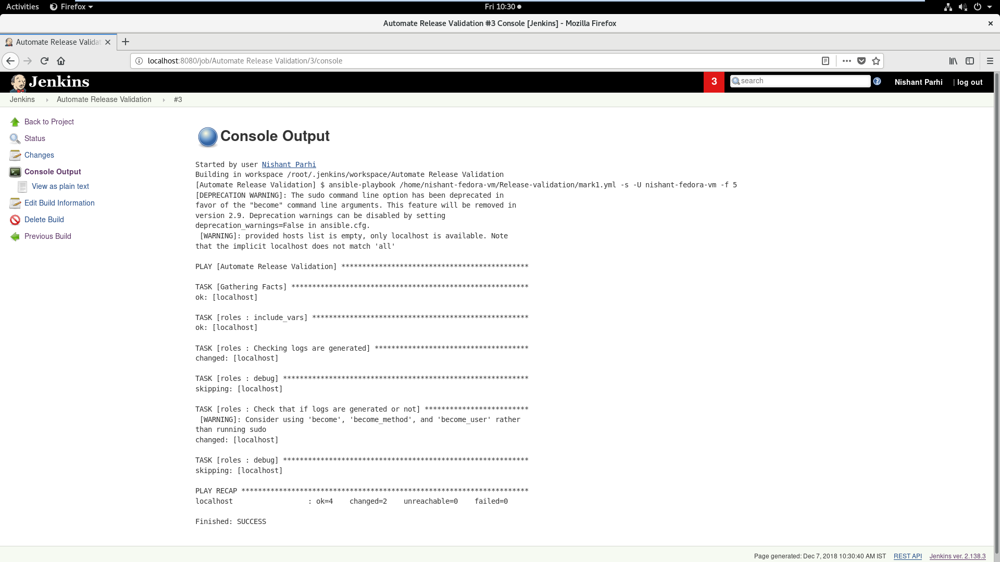

# ReleaseAutomation

 The main aim of the task is to automate Fedora release validation using Jenkins(Ansible Plugin)
 
 This task aims to automate(https://fedoraproject.org/wiki/QA:Testcase_base_system_logging)
 
 1. Initialize jenkins and go to `http://localhost:8080`
 2. Add a new item.
 3. Name your project and then choose freestyle project.
 4. In the configuration page, choose the `Invoke ansible playbook` option from the build drop down.
 5. Give the location of the playbook and then tick the sudo mode.
 6. Save and build.
 7. Go to console output to look at the output

**NOTE: If you get any errors while running try chmod 777 <- filename ->
